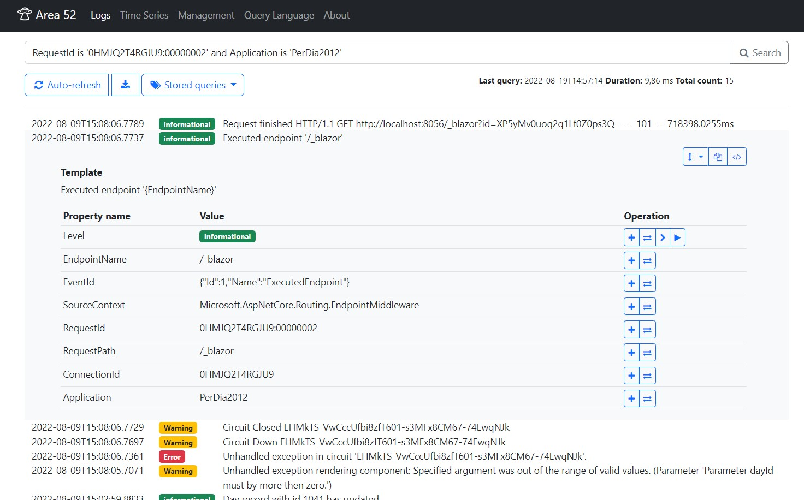

# Area 52

Experimental structured log collector with logs visualization
inspired by [Seq](https://datalust.co/seq) and [ELK Stack](https://www.elastic.co/what-is/elk-stack).

This project uses [RavenDb](https://ravendb.net/) or MongoDb as a log store and serach engine.

> Everyone wants to know what's in _Area 51_. But no one asks about _Area 52_.

## Features
- Log input endpoint compatibile wirh _Seq_ ([CLEF](https://docs.datalust.co/docs/posting-raw-events) logs format)
- Custom query language (inspired by Rockstar language and SQL), supports:
  - fulltext serach,
  - search by match property, comparison,
  - serach by time,
  - logical operator,
  - and more...
- _Area52.Ufo_ is service for abducing logs from text files and from Syslog (UDP by _RFC 5424_) into _Area52_



Moore screenshots [doc/Readme.md](doc/Readme.md).

## Technology
- [Dotnet 6.0](https://docs.microsoft.com/en-us/dotnet/core/whats-new/dotnet-6)
- [Blazor server](https://docs.microsoft.com/en-us/aspnet/core/blazor/hosting-models?view=aspnetcore-6.0)
- [Piglet](https://www.nuget.org/packages/Piglet/) as query parser
- [RavenDb](https://ravendb.net/) as primary storage and indexing engine
- [MongoDb](https://www.mongodb.com/) as alternative storage and indexing engine
- [Bootstrap 5](https://getbootstrap.com/) and [Font Awesome 4](https://fontawesome.com/v4/icons/)

## Build
Area52 use [Nuke](https://nuke.build/) as build automation.

For build run in powershell:
```
&dotnet tool restore
.\build.ps1 --Configuration Release
```

## Future work
- [ ] More efective read CLEF log from request
- [ ] Autehntification
  - [x] Predefined queries
  - [x] Distributed data protection provider
  - [x] API keys for log input with management
- [ ] Graph and alerts as subsriptions
  - [x] Time series graphs
  - [ ] Alerts
- [ ] Log archiving using background workers
- [x] Implements healthchecks
- [x] Try implement using MongoDb
- [x] Dashboard
- [ ] Local query history (button for clear query)

## Getting logs into Area 52
It is possible to use libraries for SEQ.
_Serilog_ example:

```
dotnet package add Serilog.Sinks.Seq
```

```cs
using Serilog;

Log.Logger = new LoggerConfiguration()
   .MinimumLevel.Verbose()
   .WriteTo.Seq("http://localhost:7142")
   .CreateLogger();
```

_NLog_ example:
```
dotnet package add NLog.Targets.Seq
```

Add to _NLog.config_:
```xml
<extensions>
    <add assembly="NLog.Targets.Seq"/>
</extensions>
```

```xml
<targets>
   <target name="seq" xsi:type="BufferingWrapper" bufferSize="1000" flushTimeout="2000">
     <target xsi:type="Seq" serverUrl="http://localhost:7142" apiKey="" />
   </target>
</targets>
<rules>
  <logger name="*" minlevel="Info" writeTo="seq" />
</rules>
```

For log into file see [doc/FileLogging.md](doc/FileLogging.md).

## Copyright
Copyright (c) 2023 harrison314
