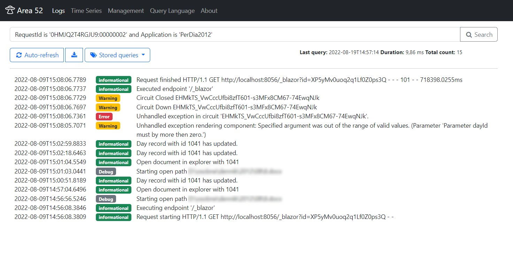

# Area 52

Experimental structured log collector with logs visualization
inspired by [Seq](https://datalust.co/seq) and [ELK Stack](https://www.elastic.co/what-is/elk-stack).

This project uses [RavenDb](https://ravendb.net/) or MongoDb as a log store and serach engine.

> Everyone wants to know what's in _Area 51_. But no one asks about _Area 52_.

## Features
- Log input endpoint compatibile wirh _Seq_ ([CLEF](https://docs.datalust.co/docs/posting-raw-events) logs format)
- Custom query language (inspired by Rockstar language and SQL), supports:
  - fulltext serach,
  - search by match property, comparison,
  - serach by time,
  - logical operator,
  - and more...




## Technology
- [Dotnet 6.0](https://docs.microsoft.com/en-us/dotnet/core/whats-new/dotnet-6)
- [Blazor server](https://docs.microsoft.com/en-us/aspnet/core/blazor/hosting-models?view=aspnetcore-6.0)
- [Piglet](https://www.nuget.org/packages/Piglet/) as query parser
- [RavenDb](https://ravendb.net/) as primary storage and indexing engine
- [MongoDb](https://www.mongodb.com/) as alternative storage and indexing engine
- [Bootstrap 5](https://getbootstrap.com/) and [OpenIcon](https://useiconic.com/open/)

## Future work
- [ ] More efective read CLEF log from request
- [ ] Autehntification
  - [ ] Predefined queries
  - [x] Distributed data protection provider
  - [ ] API keys for log input with management
- [ ] Graph and alerts as subsriptions
  - [x] Time series graphs
  - [ ] Alerts
- [ ] Log archiving using background workers
- [x] Implements healthchecks
- [x] Try implement using MongoDb
- [x] Dashboard

## Getting logs into Area 52
It is possible to use libraries for SEQ.
For example for _Serilog_:

```
dotnet package add Serilog.Sinks.Seq
```

```cs
using Serilog;

Log.Logger = new LoggerConfiguration()
   .MinimumLevel.Verbose()
   .WriteTo.Seq("http://localhost:7142")
   .CreateLogger();
```

## Copyright
Copyright (c) 2022 harrison314
